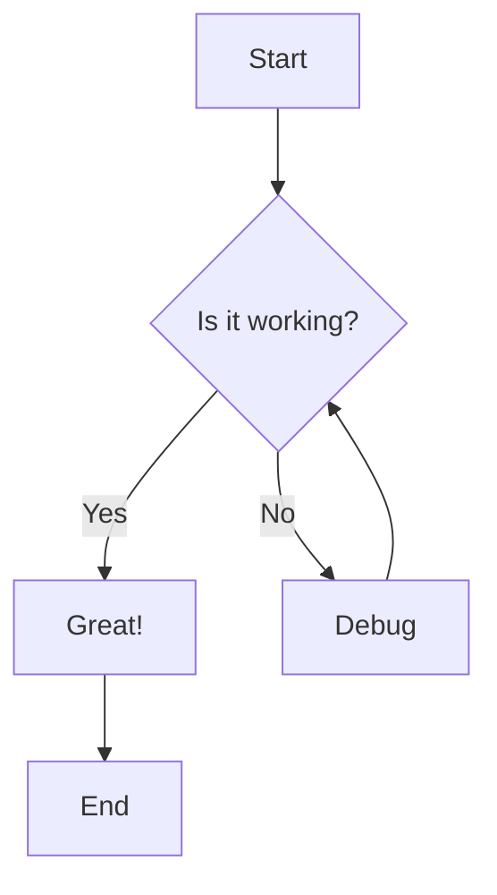
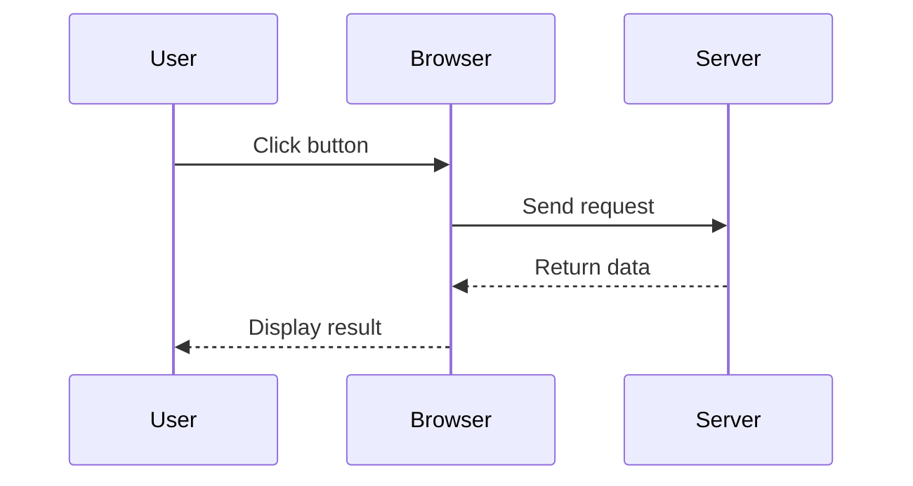
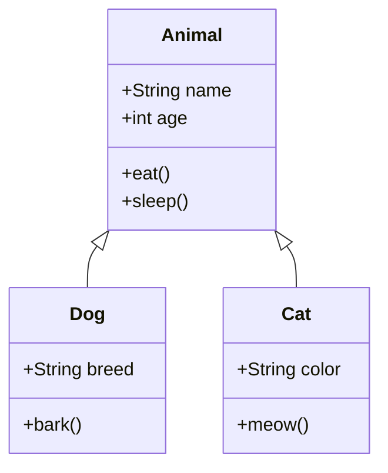

# Mermaid Diagrams Test

This page demonstrates how to use Mermaid diagrams in your markdown content.

## Simple Flowchart



## Sequence Diagram



## Class Diagram



## Regular Code Block (for comparison)

```javascript
// This is regular JavaScript code
function hello() {
  console.log('Hello, world!')
}
```
